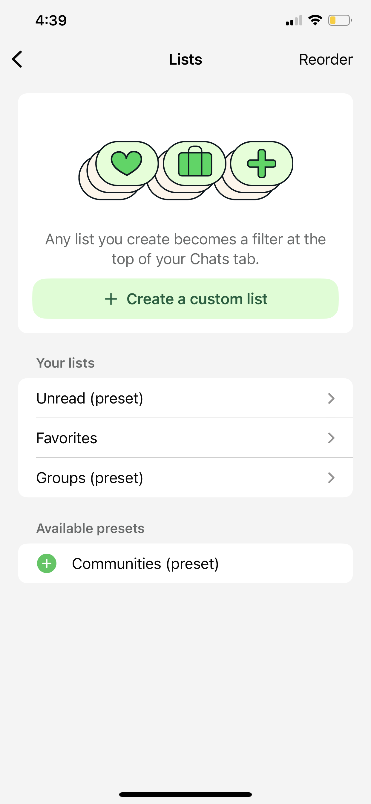
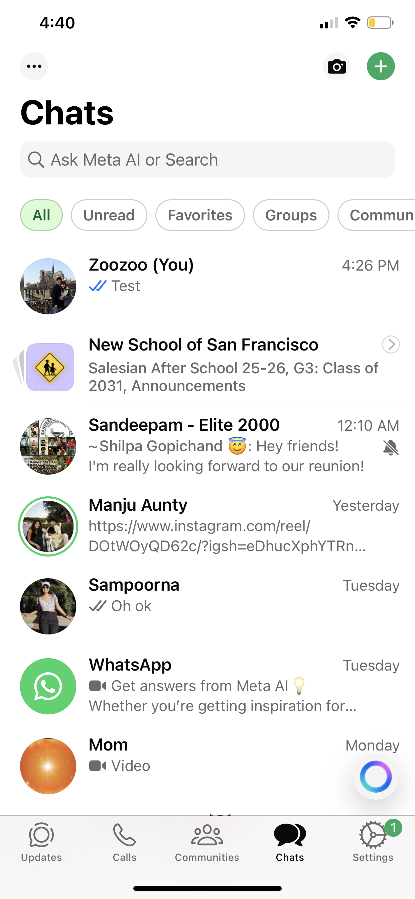
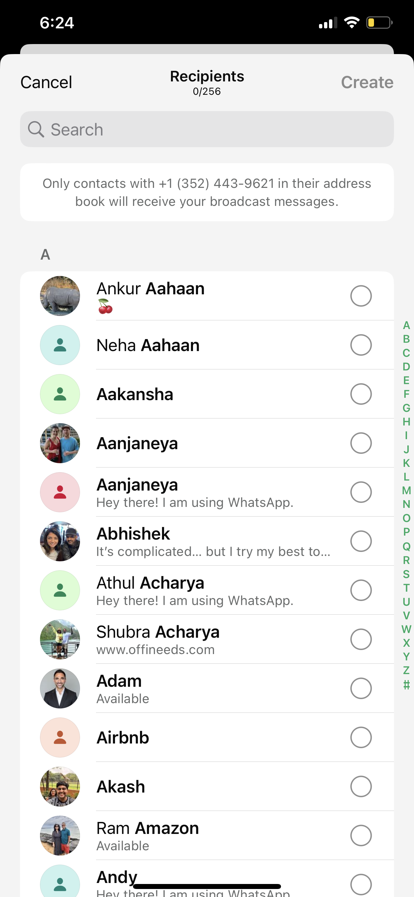
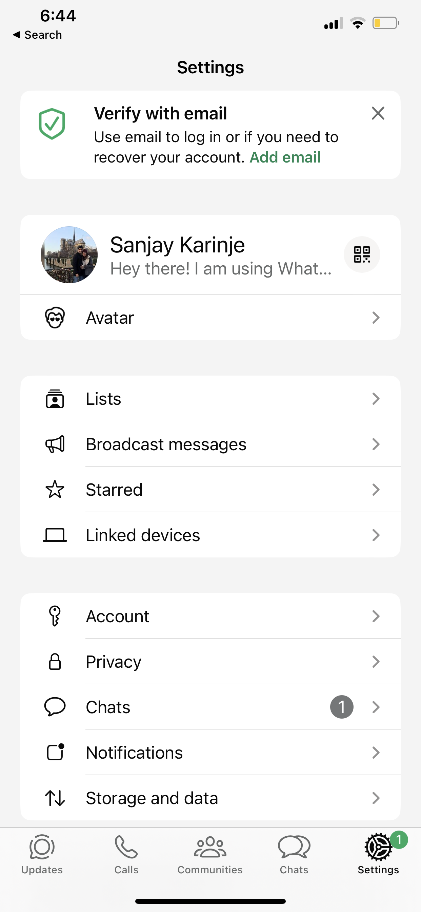
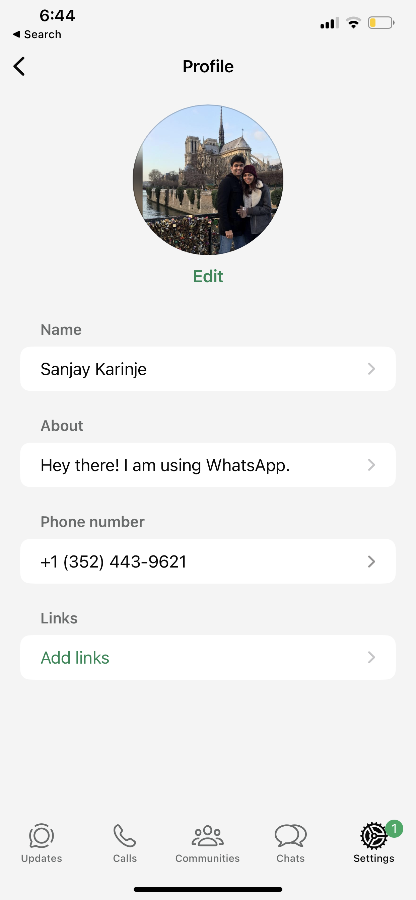
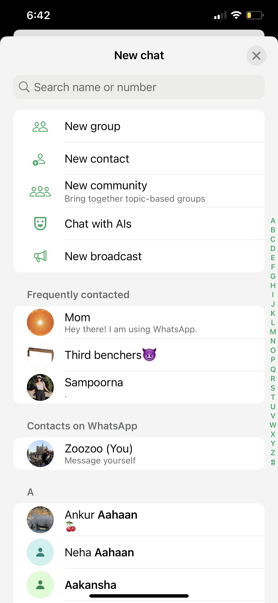

# MessageAI - Product Requirements Document (Complete)

**App Name:** Weftly (Firebase: "Weftly", Bundle ID: "com.sanjaykarinje.weftly")  
**Target Persona:** Busy Parent/Caregiver  
**Platform:** iOS (iPhone)  
**Version:** 2.0 - Complete Implementation (MVP complete, adding enhanced features + AI)

---

## Executive Summary

MessageAI (Weftly) is a cross-platform messaging app designed for busy parents who juggle multiple schedules, appointments, and family coordination. Building on the solid MVP messaging infrastructure, this complete version adds enhanced organizational features, privacy controls, broadcast capabilities, and AI-powered assistance to score **Excellent (90-100 points)** on all rubric criteria.

---

## Table of Contents

1. [User Persona & Pain Points](#user-persona--pain-points)
2. [Complete Feature Specifications](#complete-feature-specifications)
3. [App Structure - 4 Tabs](#app-structure---4-tabs)
4. [Core Messaging Requirements (Rubric-Driven)](#core-messaging-requirements-rubric-driven)
5. [Mobile App Quality Standards](#mobile-app-quality-standards)
6. [AI Features (Post-MVP)](#ai-features-post-mvp)
7. [Technical Implementation](#technical-implementation)
8. [Success Criteria & Testing](#success-criteria--testing)
9. [Timeline & Milestones](#timeline--milestones)

---

## User Persona & Pain Points

### Primary Persona: Busy Parent/Caregiver

**Background:**
- Sarah is a working mom with two kids (ages 7 and 10)
- Coordinates schedules with spouse, school, babysitters, and other parents
- Uses group chats for soccer team, PTA, family, and work
- Often in situations with poor connectivity (grocery stores, school parking lots)
- Needs quick, reliable communication without cognitive overhead

**Core Pain Points:**
1. **Schedule juggling** - Coordinating multiple activities, appointments, pickups
2. **Missing dates/appointments** - Important commitments buried in chat threads
3. **Decision fatigue** - Group chat discussions become overwhelming
4. **Information overload** - Dozens of messages across multiple groups
5. **Message organization** - Difficulty filtering important vs casual messages
6. **Privacy concerns** - Wants control over online visibility and read receipts
7. **Broadcast needs** - Sending same message to multiple people individually

---

## Complete Feature Specifications

### ✅ MVP Features (Already Implemented)

- Email/password authentication
- One-on-one text messaging with real-time delivery
- Group chat (3+ participants)
- Message persistence with SwiftData
- Optimistic UI updates
- ✅ **Online/offline presence indicators** - Action-based updates with 10-minute timeout
- ✅ **Typing indicators** - Real-time conversation listener implemented
- Message status (sending → sent → delivered → read)
- Read receipts
- Image sharing via Firebase Storage
- Offline message queue with auto-retry
- Push notifications (FCM + APNs)
- Profile pictures and display names

**Online Presence & Last Seen System (Cost-Optimized, WhatsApp-Style):**

**Where "Last Seen" is Displayed:**
1. ✅ **Chat Header (1:1 conversations)** - Below contact name shows:
   - "online" (if user active within last 10 minutes)
   - "last seen today at 3:45 PM" (if offline, seen today)
   - "last seen yesterday at 2:30 PM" (if offline, seen yesterday)
   - "last seen Monday at 4:15 PM" (if offline, seen this week)
   - "last seen 10/20/24 at 8:00 PM" (if older)
2. ✅ **Chat List** - Green dot indicator when online
3. 🔜 **Contact Info Screen** - Full last seen details (future PR)
4. 🔜 **Group Member Tap** - Individual member presence (future PR)

**Data Storage (User-Level, Global):**
```
users/{userId}/
  - isOnline: boolean      // Explicitly set by app actions
  - lastSeen: timestamp    // Last activity time, global across all chats
```

**`lastSeen` Update Triggers (8 explicit actions, NO automatic heartbeat):**
1. **Sign up** → `isOnline: true, lastSeen: now`
2. **Sign in** → `isOnline: true, lastSeen: now`
3. **App launch (logged in)** → `isOnline: true, lastSeen: now`
4. **App foreground** → `isOnline: true, lastSeen: now`
5. **Open any chat** → `isOnline: true, lastSeen: now`
6. **Send message** → `isOnline: true, lastSeen: now`
7. **App background** → `isOnline: false, lastSeen: now`
8. **Sign out** → `isOnline: false, lastSeen: now`

**Online Status Calculation (Hybrid Logic in `PresenceViewModel`):**
```swift
if (timeSinceLastSeen > 600 seconds) {  // 10 minutes
    calculatedOnline = false   // Timeout - handles force quit/crash
} else if (isOnline == false) {
    calculatedOnline = false   // Explicit signout/background - immediate offline
} else {
    calculatedOnline = true    // isOnline=true AND recent activity - show online
}
```

**Behavior Across Scenarios:**
- **Normal use**: User opens chat → lastSeen updates → shows online
- **Silent reading 8 min**: User reading messages → no updates → still shows online (< 10 min)
- **Silent reading 12 min**: User reading messages → no updates → shows offline (> 10 min timeout)
- **App background**: Immediate offline status, lastSeen updated
- **Sign out**: Immediate offline status, lastSeen updated
- **Force quit/crash**: Stays online for up to 10 minutes, then timeout shows offline
- **Network drop**: No updates sent → timeout after 10 minutes shows offline

**Key Design Decisions:**
- ✅ **User-level (global)**: Activity in ANY chat updates global lastSeen visible to ALL contacts
- ✅ **No heartbeat timer**: Saves ~80-90% Firestore writes vs polling approach
- ✅ **10-minute grace period**: Balances UX (users stay online while reading) with accuracy
- ✅ **Cost efficiency**: ~5-10 Firestore writes per active user per hour (demo-friendly)

### 🎯 Enhanced Features (This Phase)

#### **1. Lists & Filters System**



**Purpose:** Help busy parents organize and filter conversations efficiently

**Implementation:**
- **Create Custom Lists:** User-defined lists that appear as filters at top of Chats tab
- **Preset Lists:** 
  - **Unread** (shows only conversations with unread messages)
  - **Favorites** (user-marked important conversations)
  - **Groups** (filters to show only group chats)
- **List Management:** Add/remove conversations from lists, reorder lists
- **Visual Indicators:** List filter chips at top of Chats tab (horizontal scroll if many)
- **Persistence:** Lists stored in Firestore under user document
- **Real-time Updates:** List counts update as messages arrive

**Data Model:**
```
users/{userId}/lists/
  {listId}/
    - name: string
    - conversationIds: [string]
    - icon: string (optional)
    - createdAt: timestamp
```

#### **2. Broadcast Messages**


**Purpose:** Send identical message to multiple contacts without creating group chat

**Implementation:**
- **New List Button:** Bottom of Broadcast Messages screen
- **Recipient Selection:** Import from contacts, checkboxes for selection
- **Message Composition:** Single message input, sent as individual 1:1 chats
- **Send Behavior:** Creates/updates existing 1:1 conversations with each recipient
- **Empty State:** "You should use broadcast lists to message multiple people at once"
- **Saved Broadcast Lists:** Store frequently used recipient groups
- **Delivery Tracking:** Individual delivery status per recipient

**Data Model:**
```
users/{userId}/broadcastLists/
  {listId}/
    - name: string
    - recipientIds: [string]
    - lastUsed: timestamp
    - messageCount: number
```

#### **3. Privacy Controls**


**Purpose:** Give users control over online visibility and read receipt sharing (WhatsApp-style reciprocal privacy)

**Implementation:**
- **Last Seen & Online Toggle:**
  - **ON (default):** Others see your online status (green dot) and "last seen" timestamp
  - **OFF:** You appear offline to others, no timestamp visible
  - **Reciprocal:** If you turn OFF, you also cannot see others' status
  - **Exception:** Always shows "online" during active messaging with that person

- **Read Receipts Toggle:**
  - **ON (default):** Others see when you've read their messages (blue double checkmark)
  - **OFF:** Your read receipts not sent to others
  - **Reciprocal:** If you turn OFF, you also cannot see others' read receipts
  - **Exception:** Group chats always show read receipts (can't be disabled)

**Data Model:**
```
users/{userId}/
  - privacySettings:
      lastSeenEnabled: boolean
      readReceiptsEnabled: boolean
```

**Backend Logic:**
- Check recipient's `privacySettings` before sending presence updates
- Read receipt updates only sent if both users have receipts enabled
- Group chats bypass read receipt privacy (always sent)

#### **4. Enhanced Account Management**


**Implementation:**
- **Profile Picture Upload:**
  - Large circular avatar at top
  - "Edit" button below photo
  - Tap to select new photo from camera roll
  - Compression (max 1920px, JPEG 0.7 quality)
  - Upload to Firebase Storage, URL saved in user doc

- **About Field:**
  - Text field for status/bio (max 139 characters)
  - Examples: "Hey there! I am using WhatsApp.", "Busy parent of two 🚗⚽️"
  - Editable inline or via dedicated edit screen

- **Phone Number:**
  - Display-only field (from authentication)
  - Format: +1 (XXX) XXX-XXXX
  - Used for contact matching

- **Sign Out:**
  - Confirmation alert: "Are you sure?"
  - Clears local auth token
  - Removes FCM token from user doc
  - Returns to login screen

- **Delete All Chats:**
  - Destructive action with confirmation
  - Alert: "This will delete all your chat history. This cannot be undone."
  - Deletes local SwiftData messages
  - Optionally delete Firestore conversations (user-specific)

- **Delete Account:**
  - Most destructive action with double confirmation
  - Alert 1: "Delete account? All your data will be permanently removed."
  - Alert 2: "Are you absolutely sure? This cannot be undone."
  - Deletes user document from Firestore
  - Deletes user's messages from all conversations
  - Removes profile picture from Storage
  - Deletes Firebase Auth account
  - Returns to signup screen

#### **5. Contacts Integration**


**Purpose:** Import phone contacts to easily find other users

**Implementation:**
- **Contacts Permission:** Request at first app launch or on first "New Chat" tap
- **Phone Number Matching:** 
  - Upload hashed phone numbers to Firestore for privacy
  - Match against other users' phone numbers
  - Display matched contacts with "On Weftly" badge

- **Import Flow:**
  - System prompt: "Weftly would like to access your contacts"
  - If granted: Background sync of contacts
  - If denied: Show manual "Add Contact" option

- **Contacts Screen (in New Chat flow):**
  - **Section 1:** "New Group", "New Contact" options
  - **Section 2:** "Frequently contacted" (top 3-5 based on message count)
  - **Section 3:** "Contacts on Weftly" (alphabetical list with avatars)
  - **Section 4:** "Invite to Weftly" (contacts not on app, shows invite button)

**Data Model:**
```
users/{userId}/
  - phoneNumber: string (E.164 format)
  - phoneNumberHash: string (SHA-256 for matching)
  - contactsSynced: boolean
  - contactSyncTimestamp: timestamp
```

#### **6. Camera & Photo Access**


**Purpose:** Quick access to camera and photo library from Chats tab

**Implementation:**
- **Camera Button (top right):**
  - Tap → Opens bottom sheet: "Take Photo" or "Choose from Library"
  - **Take Photo:** Launches system camera, capture photo, select recipient
  - **Choose from Library:** Opens PhotosUI picker, select photo(s), select recipient
  - **After selection:** Opens chat with selected contact, photo attached to input field

- **Permissions:**
  - Camera: Request on first "Take Photo" tap
  - Photo Library: Request on first "Choose from Library" tap
  - If denied: Show settings alert

#### **7. Message Search**


**Purpose:** Find messages across all conversations

**Best Implementation Approach:**
- **Option A: Firestore Queries (Recommended for MVP)**
  - Index messages by `text` field (Firestore full-text not available, use keyword matching)
  - Query across all user's conversations where `text` contains search term
  - Limitation: Case-insensitive, exact substring match only
  - Pros: Simple, no additional service
  - Cons: Limited to basic text search

- **Option B: Algolia (Best for Production)**
  - Export messages to Algolia index via Cloud Function
  - Full-text search with typo tolerance, ranking
  - Search across all conversations with instant results
  - Pros: Professional search, fast, fuzzy matching
  - Cons: Additional service, costs scale with usage

- **Option C: Local SQLite FTS (Future Consideration)**
  - Use SwiftData/CoreData full-text search
  - Search only local cached messages
  - Pros: Fast, offline-capable
  - Cons: Only searches what's cached locally

**Recommended for now:** Option A with Firestore queries. Implement search bar that:
- Filters conversations by display name (instant)
- Searches message content within selected conversation (when chat open)
- Future upgrade: Add Algolia in production

---

## App Structure - 4 Tabs

### Tab Bar Layout (Bottom Navigation)

```
┌─────────────────────────────────────────────┐
│  [AI]  [Chats]  [Updates]  [Settings]      │
└─────────────────────────────────────────────┘
```

---

### Tab 1: Settings (Rightmost)


**Primary View: Settings List**

**Header Section:**
- Large title: "Settings"
- No additional controls

**Account Section:**
- **Profile Card (tappable, opens Profile Edit):**
  - Large circular avatar (120pt diameter)
  - Display name below avatar
  - About text below name (gray, truncated)
  - QR code icon (top right of card) - future feature

- **Avatar Management:**
  - Tap avatar card → Opens ProfileView
  - ProfileView shows:
    - Avatar (centered, 200pt diameter)
    - "Edit" button below avatar
    - Name field (tappable, opens edit)
    - About field (tappable, opens edit)
    - Phone number (display only)
  - Tap "Edit" button → Opens PhotosPicker
  - After photo selection: Upload to Storage, update Firestore

**Lists Section:**


- **Header:** "Lists" with chevron (taps to ListsView)
- **Lists Overview:**
  - Shows icon preview of active lists
  - Subtitle: "Organize your chats with custom lists"
  
**ListsView (full screen):**
- **Top Card:**
  - Icon illustration (heart, briefcase, plus symbols)
  - Text: "Any list you create becomes a filter at the top of your Chats tab."
  - **Button:** "+ Create a custom list" (green, full width)

- **Your Lists Section:**
  - Unread (preset) - tap to configure
  - Favorites - tap to configure  
  - Groups (preset) - tap to configure
  - [Custom Lists] - user-created lists appear here

- **Available Presets Section:**
  - Communities (preset) with + icon to activate

- **Create Custom List Flow:**
  1. Tap "+ Create a custom list"
  2. Sheet appears: Name input, Icon picker (optional)
  3. Select conversations to add (checklist)
  4. Tap "Create" → List appears in "Your Lists" and as filter on Chats tab

**Broadcast Messages Section:**


- **Header:** "Broadcast messages" with chevron (taps to BroadcastView)

**BroadcastView (full screen):**
- **Empty State:**
  - Center text: "You should use broadcast lists to message multiple people at once"
  - **Button (bottom):** "New List" (green, with icon)

- **Create Broadcast List Flow:**
  1. Tap "New List" button
  2. Opens contact selection screen (similar to New Group)
  3. Search bar at top
  4. Alphabetical contact list with checkboxes
  5. Selected count: "0/256" at top
  6. Tap "Create" → Name the list
  7. Save → Returns to BroadcastView showing created lists

- **Broadcast List Item:**
  - List name (e.g., "Soccer Parents")
  - Recipient count (e.g., "12 recipients")
  - Tap to view/edit
  - Tap to broadcast message

**Privacy Section:**
- **Header:** "Privacy" with chevron (taps to PrivacyView)

**PrivacyView (full screen):**
- **Last seen and online:**
  - Toggle switch (default: ON)
  - Subtitle: "If you don't share your Last Seen and Online, you won't be able to see other people's Last Seen and Online."
  - When ON: Others see green dot when you're active, timestamp when you were last active
  - When OFF: You appear offline, no timestamp; you also can't see others' status

- **Read receipts:**
  - Toggle switch (default: ON)
  - Subtitle: "If you don't share your Read Receipts, you won't be able to see other people's Read Receipts."
  - When ON: Others see blue double checkmark when you read messages
  - When OFF: No read receipts sent; you also can't see others' read receipts
  - Note: "Read receipts are always sent for group chats."

**Account Actions (Bottom of Settings):**
- **Sign Out:** Tap → Confirmation alert → Logout
- **Delete All Chats:** Tap → Confirmation alert → Deletes local SwiftData messages
- **Delete Account:** Tap → Double confirmation → Deletes everything, removes Firebase Auth

---

### Tab 2: Chats (Second from Right)


**Navigation Bar:**
- **Title:** "Chats" (large title, bold)
- **Leading (left):** Three-dot menu icon (future: archived chats, settings shortcut)
- **Trailing (right):**
  - **Camera icon:** Taps to open camera/photo picker bottom sheet
  - **Plus (+) icon:** Taps to open "New Chat" modal

**Search Bar:**
- Directly below navigation bar
- Placeholder: "Ask Meta AI or Search" (or just "Search" for MVP)
- Tapping expands to search mode:
  - Searches conversation names (real-time filter)
  - Future: Search message content using Algolia

**Filter Chips (Horizontal Scroll):**
- Directly below search bar
- **Default chips:** All | Unread | Favorites | Groups
- **Custom chips:** User-created lists from Settings → Lists
- Tapping a chip filters conversation list to show only matching conversations
- Active chip highlighted with green background
- Chips persist scroll position

**Conversation List:**
- **Each Row Shows:**
  - Avatar (left) - profile picture or initials
  - Online indicator (green dot on avatar if online)
  - **Conversation name** (bold if unread)
  - **Last message preview** (gray, truncated)
  - **Timestamp** (right, gray) - "4:26 PM", "Yesterday", "Monday", etc.
  - **Unread badge** (right, green circle with count)
  - **Read status** (if sender): checkmarks (gray → blue)
  - **Muted icon** (if conversation muted)

- **Swipe Actions:**
  - **Swipe left:** Archive (future), Delete
  - **Swipe right:** Mark as unread/read, Pin (future)

- **Long Press Actions:**
  - Add to List
  - Mute notifications
  - Mark as unread
  - Delete conversation

**Empty State:**
- Icon: Speech bubble
- Text: "No conversations yet"
- Button: "Start a chat"

**Camera/Photo Picker (Top Right Icon):**
- **Tap Camera Icon → Bottom Sheet:**
  - "Take Photo" (opens system camera)
  - "Choose from Library" (opens PhotosPicker)
- **After Photo Selection:**
  - Shows contact selection screen
  - Select recipient
  - Opens chat with photo attached to input field, ready to send

**Plus (+) Button → New Chat Modal:**


**Modal Content:**
- **Search Bar:** "Search name or number"
- **Action List:**
  - **New group** (icon: two people, green)
  - **New contact** (icon: person with +, green)
  - **New community** (icon: three people, green) - future
  - **Chat with AIs** (icon: robot face, green) - links to AI tab
  - **New broadcast** (icon: megaphone, green) - links to Broadcast creation

- **Frequently contacted** section:
  - Shows top 3-5 contacts based on message frequency
  - Avatar, name, about text preview

- **Contacts on Weftly** section:
  - Alphabetical list with section headers (A, B, C...)
  - Avatar, name, about text
  - Tapping opens chat with that contact

**Contacts Import:**
- **First Time User:** Prompt appears: "Weftly needs access to your contacts to find friends"
  - "Allow" → Syncs contacts in background
  - "Don't Allow" → Shows manual "Add Contact" option only

- **Sync Logic:**
  - Extract phone numbers from device contacts
  - Hash phone numbers (SHA-256)
  - Upload hashes to Firestore (privacy-preserving)
  - Match against other users' hashes
  - Display matched users in "Contacts on Weftly"

- **Settings Integration:**
  - Settings → Contacts → "Sync Contacts" toggle
  - "Re-sync Contacts" button (manual refresh)

---

### Tab 3: AI Features (Third from Right)

**Placeholder for Now:**
- Tab icon: Sparkle/star icon
- Title: "AI Assistant"
- Empty state: "AI features coming soon"
- Description: "Smart calendar extraction, decision summarization, priority detection, RSVP tracking, and deadline reminders"

**Future Implementation (Post-MVP):**
See [AI Features Section](#ai-features-post-mvp)

---

### Tab 4: Updates (Fourth from Right)

**Purpose:** WhatsApp-style status updates / stories feature

**For MVP (Minimal Implementation):**
- Tab icon: Concentric circles icon
- Title: "Updates"
- Empty state: "No updates yet"
- Subtitle: "Share photos, videos, and status updates that disappear after 24 hours"
- **Button:** "Add status" (future implementation)

**Future Features:**
- 24-hour photo/video status updates
- View who's seen your status
- Privacy controls (share with all, selected contacts, except...)

---

## Core Messaging Requirements (Rubric-Driven)

### Real-Time Message Delivery (Target: 11-12/12 points)

**Targets:**
- ✅ Sub-200ms message delivery on good network
- ✅ Messages appear instantly for all online users
- ✅ Zero visible lag during rapid messaging (20+ messages)
- ⚠️ **Typing indicators work smoothly** - NEEDS FIXING (not currently working)
- ⚠️ **Presence updates sync immediately** - NEEDS FIXING (stuck on green)

**Implementation:**
- Firestore real-time listeners on conversations
- WebSocket connection maintained while app active
- Optimistic UI updates with local cache
- Background queue for pending sends

**Known Issues:**
- ⚠️ **Typing indicators:** Component exists (`TypingIndicatorView.swift`) but doesn't display when other user types
  - Debug: Check if `isTyping` field updates in Firestore
  - Debug: Verify Firestore listener is attached correctly
  - Debug: Add console logs to track typing events
- ⚠️ **Presence indicator:** Always shows green dot, doesn't update to gray when user goes offline
  - Debug: Check if `lastSeen` timestamp updates in Firestore Console
  - Debug: Verify lastSeen updates on app lifecycle (foreground/background/terminate)
  - Debug: Check `OnlineStatusView` logic: `Date().timeIntervalSince(lastSeen) < 300`

**Verification Scenarios:**
- Send 20 rapid-fire messages → all deliver instantly ✅
- Two users typing simultaneously → indicators should show (currently broken) ⚠️
- User goes offline → presence should update to gray after 5 mins (currently broken) ⚠️

---

### Offline Support & Persistence (Target: 11-12/12 points)

**Targets:**
- ✅ User goes offline → messages queue locally → send when reconnected
- ✅ App force-quit → reopen → full chat history preserved
- ✅ Messages sent while offline appear for other users once online
- ✅ Network drop (30s+) → auto-reconnects with complete sync
- ✅ Clear UI indicators for connection status and pending messages
- ✅ Sub-1 second sync time after reconnection

**Implementation:**
- SwiftData for local persistence
- Message queue table for pending sends
- NetworkMonitor tracks connectivity changes
- Retry logic with exponential backoff
- Connection status banner at top of chat

**Verification Scenarios:**
1. Enable airplane mode → send 5 messages → disable airplane mode → all deliver
2. Force quit mid-send → reopen → message completes sending
3. Poor network (3G simulation) → messages queue and send when stable
4. Receive messages while offline → immediately visible when online

---

### Group Chat Functionality (Target: 10-11/11 points)

**Targets:**
- ✅ 3+ users can message simultaneously
- ✅ Clear message attribution (names/avatars in group)
- ✅ Read receipts show who's read each message
- ✅ Typing indicators work with multiple users
- ✅ Group member list with online status
- ✅ Smooth performance with active conversation

**Implementation:**
- Conversation document with `participants` array
- Message documents include `senderId` and `senderName`
- Read receipts as `readBy: [userId]` array
- Group typing indicator shows "Alice and Bob are typing..."
- Member roster at top of group chat (horizontal scroll)

**Verification Scenarios:**
- Create group with 5 users → all receive messages instantly
- 3 users typing simultaneously → indicator shows all names
- Send message → see read receipts populate as users read
- Group member taps → shows member list with online status

---

## Mobile App Quality Standards

### Mobile Lifecycle Handling (Target: 7-8/8 points)

**Targets:**
- ✅ App backgrounding → WebSocket reconnects instantly on foreground
- ✅ Foregrounding → instant sync of missed messages
- ✅ Push notifications work when app is closed
- ✅ No messages lost during lifecycle transitions
- ✅ Battery efficient (no excessive background activity)

**Implementation:**
- `SceneDelegate` / `WeftlyApp` lifecycle handlers
- Store WebSocket state on background
- Reconnect on `sceneWillEnterForeground`
- FCM for background message delivery
- Local notification proxy for foreground (suppressed when viewing active chat)

---

### Performance & UX (Target: 11-12/12 points)

**Targets:**
- ✅ App launch to chat screen <2 seconds
- ✅ Smooth 60 FPS scrolling through 1000+ messages
- ✅ Optimistic UI updates (messages appear instantly before server confirm)
- ✅ Images load progressively with placeholders
- ✅ Keyboard handling perfect (no UI jank)
- ✅ Professional layout and transitions

**Implementation:**
- SwiftData lazy loading (fetch 50 messages at a time)
- `Nuke` library for image caching and progressive loading
- Optimistic message insertion in local cache
- Keyboard avoidance with `.ignoresSafeArea(.keyboard)`
- Smooth animations using `.animation(.spring())`

**Performance Monitoring:**
- Measure launch time with Instruments
- Profile scroll performance with 1000+ messages
- Test on older devices (iPhone 11 minimum)

---

## AI Features (Post-MVP)

### Persona: Busy Parent/Caregiver

**Required AI Features (All 5):**

#### 1. Smart Calendar Extraction
**What:** Automatically detect dates, times, and events mentioned in messages

**Examples:**
- "Soccer practice next Tuesday at 4pm" → Extracts: "Soccer practice" on [next Tuesday] at 4:00 PM
- "Doctor appointment December 15th at 2:30" → Extracts: "Doctor appointment" on Dec 15 at 2:30 PM
- "School meeting tomorrow morning at 9" → Extracts: "School meeting" on [tomorrow] at 9:00 AM

**Implementation:**
- Cloud Function triggered on new message
- LLM (GPT-4) with function calling
- Prompt: "Extract calendar events from this message. Return structured data: {title, date, time, location}"
- UI: Event chip below message with "Add to Calendar" button
- iOS EventKit integration to create calendar events

**Success Criteria:**
- 90%+ accuracy on explicit dates
- 80%+ accuracy on relative dates ("next Tuesday")
- Handles multiple events in one message

---

#### 2. Decision Summarization
**What:** Summarize group chat decisions to avoid re-reading 50+ messages

**Examples:**
- Group decides on birthday party location → Summary: "Decided on Pizza Palace, Saturday 3pm, $15/child"
- Carpooling discussion → Summary: "Alice picking up Bob's kids Mon/Wed, Bob picks up Alice's kids Tue/Thu"

**Implementation:**
- User taps "Summarize Decisions" button in group chat
- Retrieves last 100 messages from conversation
- LLM prompt: "Identify final decisions made in this conversation. Ignore discussion, focus on consensus."
- Display summary in modal with timestamps

**Success Criteria:**
- Correctly identifies final decisions vs ongoing discussion
- Includes key details (who, what, when, where)
- <3 second response time

---

#### 3. Priority Message Highlighting
**What:** Automatically flag urgent/important messages

**Examples:**
- "URGENT: School closed tomorrow due to weather" → Priority: Urgent
- "Permission slip due Friday!!!" → Priority: Important
- "Can you pick up milk?" → Priority: Normal

**Implementation:**
- Background Cloud Function on message creation
- LLM analyzes message sentiment, keywords, punctuation
- Stores priority level in message document: `priority: "urgent" | "important" | "normal"`
- UI: Red border for urgent, orange for important
- Filter chip on Chats tab: "Priority Messages"

**Success Criteria:**
- <5% false positive rate
- All-caps + exclamation marks → flagged
- Emergency keywords → flagged
- Normal messages not over-flagged

---

#### 4. RSVP Tracking
**What:** Track event confirmations in group chats

**Examples:**
- Parent asks: "Who can come to the bake sale Saturday?"
- Responses: "I can come!" "Count me in!" "Sorry, can't make it"
- System aggregates: 5 Yes, 2 No, 3 No response

**Implementation:**
- Detect invitation messages (LLM pattern matching)
- Parse subsequent responses for sentiment (yes/no/maybe)
- Store RSVP data in conversation metadata
- UI: RSVP summary widget below invitation message
- Manual RSVP buttons (Yes/No/Maybe) for explicit responses

**Success Criteria:**
- Correctly identifies invitation messages
- Accurately classifies responses (80%+ accuracy)
- Updates count as responses arrive
- Handles multiple RSVPs from same user (latest wins)

---

#### 5. Deadline/Reminder Extraction
**What:** Auto-detect deadlines and set reminders

**Examples:**
- "Permission slip due Friday" → Reminder: "Permission slip due" on Friday at 9am
- "Doctor appointment form needs signature by end of week" → Reminder created
- "Submit registration by 5pm Thursday" → Reminder with deadline

**Implementation:**
- Cloud Function detects deadline keywords ("due", "deadline", "by", "submit by")
- Extracts task and date using LLM
- Creates local notification reminder (24 hours before deadline)
- UI: Deadline list view showing all upcoming deadlines
- Allow snooze/dismiss reminders

**Success Criteria:**
- 85%+ accuracy extracting deadlines
- Correctly schedules reminder notifications
- Doesn't create duplicates for same deadline

---

### Advanced AI Capability (Choose 1)

**Option A: Proactive Assistant** (SELECTED)

**What:** Detects scheduling conflicts and suggests solutions

**Example:**
- Receives message: "Can you pick up kids at 3pm Tuesday?"
- Checks calendar: You have dentist appointment 2:30-3:30pm Tuesday
- Proactive alert: "⚠️ Conflict detected: Dentist appointment overlaps with pickup request"
- Suggested response: "I have a dentist appointment at that time. Could we do 4pm instead?"

**Implementation:**
- Integrate EventKit (user grants calendar access)
- Cloud Function monitors new messages for time requests
- Compare against user's calendar events
- Detect conflicts (time overlap)
- Generate suggested alternative times
- UI: Conflict alert banner with suggested response button

**Success Criteria:**
- Accurately detects time conflicts (90%+ accuracy)
- Suggestions are contextually appropriate
- <5% false positive rate
- Alerts appear within 2 seconds of message receipt

---

**Option B: Multi-Step Agent** (Alternative)

**What:** Autonomously plans family activities based on preferences

**Example:**
- User: "Plan a weekend activity for the family"
- Agent:
  1. Retrieves family preferences from past conversations
  2. Checks calendar for availability
  3. Suggests 3 options with timing and cost
  4. Books reservation if user approves

**Implementation:**
- AI SDK (Vercel) or LangChain agent framework
- Tools: Calendar access, conversation history, preference storage
- Multi-step reasoning with state management
- UI: Agent chat interface with step-by-step updates

---

## Technical Implementation

### Tech Stack

**Frontend (iOS):**
- Swift 5.10+
- SwiftUI
- iOS 17.0 minimum
- SwiftData (local persistence)
- PhotosUI (image picker)
- Contacts framework (phonebook import)
- EventKit (calendar integration for AI)
- Nuke (image caching)

**Backend:**
- Firebase Auth (email/password)
- Cloud Firestore (real-time database)
- Firebase Cloud Storage (images, media)
- Firebase Cloud Messaging (push notifications)
- Firebase Cloud Functions (AI endpoints, background tasks)

**AI Services:**
- OpenAI GPT-4 (via Cloud Functions)
- Alternative: Anthropic Claude
- AI SDK by Vercel (agent framework)

---

### Data Models

#### Enhanced User Model
```swift
struct User: Codable, Identifiable {
    let id: String // Firebase Auth UID
    var email: String
    var displayName: String
    var profilePictureUrl: String?
    var about: String? // "Hey there! I am using WhatsApp."
    var phoneNumber: String // E.164 format: +15551234567
    var phoneNumberHash: String // SHA-256 for contact matching
    var lastSeen: Date?
    var fcmToken: String?
    var privacySettings: PrivacySettings
    var contactsSynced: Bool
    var contactSyncTimestamp: Date?
    var createdAt: Date
}

struct PrivacySettings: Codable {
    var lastSeenEnabled: Bool = true // If false, user is always "offline"
    var readReceiptsEnabled: Bool = true // If false, no read receipts sent
}
```

#### Lists Model
```swift
struct ConversationList: Codable, Identifiable {
    let id: String
    var name: String // "Favorites", "Work", "Family"
    var conversationIds: [String]
    var icon: String? // SF Symbol name
    var isPreset: Bool // Unread, Groups, Favorites
    var createdAt: Date
    var updatedAt: Date
}
```

#### Broadcast List Model
```swift
struct BroadcastList: Codable, Identifiable {
    let id: String
    var name: String // "Soccer Parents", "Family"
    var recipientIds: [String] // User IDs
    var lastUsed: Date?
    var messageCount: Int
    var createdAt: Date
}
```

#### Enhanced Message Model
```swift
struct Message: Codable, Identifiable {
    let id: String
    var text: String?
    var senderId: String
    var senderName: String // For group attribution
    var conversationId: String
    var timestamp: Date
    var status: MessageStatus // sending, sent, delivered, read
    var readBy: [String] // User IDs who've read this
    var mediaUrl: String? // Image URL
    var mediaType: String? // "image", "video"
    var priority: Priority? // AI-detected priority
    var replyToMessageId: String? // Future: message threading
    var extractedEvent: CalendarEvent? // AI-extracted event
    var extractedDeadline: Deadline? // AI-extracted deadline
}

enum MessageStatus: String, Codable {
    case sending, sent, delivered, read
}

enum Priority: String, Codable {
    case urgent, important, normal
}
```

#### AI Feature Models
```swift
struct CalendarEvent: Codable {
    var title: String // "Soccer practice"
    var date: Date
    var time: String? // "4:00 PM"
    var location: String?
    var extractedFromMessageId: String
}

struct Deadline: Codable {
    var task: String // "Submit permission slip"
    var dueDate: Date
    var reminderDate: Date // 24 hours before
    var extractedFromMessageId: String
    var completed: Bool
}

struct RSVPEvent: Codable {
    var title: String // "Bake sale"
    var date: Date?
    var responses: [String: RSVPResponse] // userId: response
    var invitationMessageId: String
}

enum RSVPResponse: String, Codable {
    case yes, no, maybe, noResponse
}
```

---

### Firestore Structure

```
users/
  {userId}/
    - displayName: string
    - email: string
    - phoneNumber: string
    - phoneNumberHash: string
    - profilePictureUrl: string
    - about: string
    - lastSeen: timestamp
    - fcmToken: string
    - privacySettings: {
        lastSeenEnabled: boolean
        readReceiptsEnabled: boolean
      }
    - contactsSynced: boolean
    - createdAt: timestamp
    
    lists/ (subcollection)
      {listId}/
        - name: string
        - conversationIds: [string]
        - icon: string
        - isPreset: boolean
        - createdAt: timestamp
    
    broadcastLists/ (subcollection)
      {listId}/
        - name: string
        - recipientIds: [string]
        - lastUsed: timestamp
        - messageCount: number
        - createdAt: timestamp
    
conversations/
  {conversationId}/
    - participants: [string] // User IDs
    - participantNames: {userId: displayName} // For quick display
    - lastMessage: string
    - lastMessageTime: timestamp
    - type: "direct" | "group"
    - name: string? // Group name
    - groupIcon: string?
    - unreadCount: {userId: number} // Per-user unread
    - mutedBy: [string] // User IDs who muted this
    
    messages/ (subcollection)
      {messageId}/
        - text: string
        - senderId: string
        - senderName: string
        - timestamp: timestamp
        - status: string
        - readBy: [string]
        - mediaUrl: string?
        - mediaType: string?
        - priority: string?
        - extractedEvent: {title, date, time, location}?
        - extractedDeadline: {task, dueDate, reminderDate}?
    
    rsvpEvents/ (subcollection)
      {eventId}/
        - title: string
        - date: timestamp?
        - responses: {userId: "yes"|"no"|"maybe"}
        - invitationMessageId: string
```

---

### Cloud Functions (Node.js)

```javascript
// functions/index.js

// 1. Send push notification on new message
exports.onMessageCreated = functions.firestore
  .document('conversations/{conversationId}/messages/{messageId}')
  .onCreate(async (snap, context) => {
    const message = snap.data();
    const conversationId = context.params.conversationId;
    
    // Get conversation participants
    const conversationDoc = await admin.firestore()
      .collection('conversations').doc(conversationId).get();
    const participants = conversationDoc.data().participants;
    
    // Get FCM tokens for all participants except sender
    const recipients = participants.filter(id => id !== message.senderId);
    const tokens = await getTokensForUsers(recipients);
    
    // Check each recipient's privacy settings for read receipts
    // (done in client-side Firestore rules)
    
    // Send multicast FCM message
    await admin.messaging().sendMulticast({
      tokens: tokens,
      notification: {
        title: message.senderName,
        body: message.text || '📷 Photo',
      },
      data: {
        conversationId: conversationId,
        messageId: snap.id,
      },
    });
  });

// 2. Extract calendar events (AI)
exports.extractCalendarEvent = functions.https.onCall(async (data, context) => {
  const { messageText } = data;
  
  const response = await openai.chat.completions.create({
    model: 'gpt-4',
    messages: [
      {
        role: 'system',
        content: 'Extract calendar events from messages. Return JSON: {title, date, time, location}'
      },
      { role: 'user', content: messageText }
    ],
    functions: [{
      name: 'createEvent',
      parameters: {
        type: 'object',
        properties: {
          title: { type: 'string' },
          date: { type: 'string', format: 'date' },
          time: { type: 'string' },
          location: { type: 'string' }
        },
        required: ['title', 'date']
      }
    }]
  });
  
  return response.choices[0].message.function_call.arguments;
});

// 3. Detect message priority (AI)
exports.detectPriority = functions.firestore
  .document('conversations/{conversationId}/messages/{messageId}')
  .onCreate(async (snap, context) => {
    const message = snap.data();
    
    const response = await openai.chat.completions.create({
      model: 'gpt-4',
      messages: [
        {
          role: 'system',
          content: 'Classify message priority: urgent, important, or normal. Urgent = emergencies, all-caps, multiple exclamation marks. Important = deadlines, requests. Normal = casual chat.'
        },
        { role: 'user', content: message.text }
      ],
      max_tokens: 10
    });
    
    const priority = response.choices[0].message.content.trim().toLowerCase();
    
    // Update message with priority
    await snap.ref.update({ priority });
  });

// 4. Summarize decisions (AI)
exports.summarizeDecisions = functions.https.onCall(async (data, context) => {
  const { conversationId, messageCount = 100 } = data;
  
  // Retrieve last N messages
  const messagesSnap = await admin.firestore()
    .collection(`conversations/${conversationId}/messages`)
    .orderBy('timestamp', 'desc')
    .limit(messageCount)
    .get();
  
  const messages = messagesSnap.docs.map(doc => doc.data());
  const conversationText = messages.map(m => `${m.senderName}: ${m.text}`).join('\n');
  
  const response = await openai.chat.completions.create({
    model: 'gpt-4',
    messages: [
      {
        role: 'system',
        content: 'Summarize final decisions from this group chat. Ignore discussion, focus on consensus and action items.'
      },
      { role: 'user', content: conversationText }
    ],
    max_tokens: 300
  });
  
  return { summary: response.choices[0].message.content };
});

// 5. Track RSVPs (AI)
exports.trackRSVP = functions.firestore
  .document('conversations/{conversationId}/messages/{messageId}')
  .onCreate(async (snap, context) => {
    const message = snap.data();
    const conversationId = context.params.conversationId;
    
    // Check if message is an invitation (LLM)
    const isInvitation = await detectInvitation(message.text);
    
    if (isInvitation) {
      // Create RSVP event document
      await admin.firestore()
        .collection(`conversations/${conversationId}/rsvpEvents`)
        .add({
          title: await extractEventTitle(message.text),
          invitationMessageId: snap.id,
          responses: {},
          createdAt: admin.firestore.FieldValue.serverTimestamp()
        });
    } else {
      // Check if message is a response to existing invitation
      const response = await detectRSVPResponse(message.text);
      if (response) {
        // Update RSVP event
        // (find event, update responses[userId] = response)
      }
    }
  });

// 6. Extract deadlines (AI)
exports.extractDeadline = functions.https.onCall(async (data, context) => {
  const { messageText } = data;
  
  const response = await openai.chat.completions.create({
    model: 'gpt-4',
    messages: [
      {
        role: 'system',
        content: 'Extract deadlines from messages. Return JSON: {task, dueDate}'
      },
      { role: 'user', content: messageText }
    ],
    functions: [{
      name: 'createDeadline',
      parameters: {
        type: 'object',
        properties: {
          task: { type: 'string' },
          dueDate: { type: 'string', format: 'date-time' }
        },
        required: ['task', 'dueDate']
      }
    }]
  });
  
  return response.choices[0].message.function_call.arguments;
});

// 7. Proactive Assistant - Conflict Detection
exports.detectConflict = functions.https.onCall(async (data, context) => {
  const { messageText, userCalendarEvents } = data;
  
  // Extract requested time from message
  const requestedTime = await extractTimeRequest(messageText);
  
  if (!requestedTime) return { conflict: false };
  
  // Check against user's calendar
  const conflicts = userCalendarEvents.filter(event => {
    return timesOverlap(event.start, event.end, requestedTime.start, requestedTime.end);
  });
  
  if (conflicts.length > 0) {
    // Generate suggested alternative
    const suggestion = await generateAlternativeTime(requestedTime, userCalendarEvents);
    
    return {
      conflict: true,
      conflictingEvent: conflicts[0],
      suggestedResponse: suggestion
    };
  }
  
  return { conflict: false };
});
```

---

### iOS Implementation Highlights

#### **ListsViewModel.swift**
```swift
@MainActor
class ListsViewModel: ObservableObject {
    @Published var customLists: [ConversationList] = []
    @Published var presetLists: [ConversationList] = []
    
    private let db = Firestore.firestore()
    private var listener: ListenerRegistration?
    
    func fetchLists(userId: String) {
        listener = db.collection("users/\(userId)/lists")
            .addSnapshotListener { snapshot, error in
                guard let documents = snapshot?.documents else { return }
                
                let lists = documents.compactMap { try? $0.data(as: ConversationList.self) }
                
                self.presetLists = lists.filter { $0.isPreset }
                self.customLists = lists.filter { !$0.isPreset }
            }
    }
    
    func createList(name: String, conversationIds: [String]) async throws {
        let userId = Auth.auth().currentUser!.uid
        let list = ConversationList(
            id: UUID().uuidString,
            name: name,
            conversationIds: conversationIds,
            icon: nil,
            isPreset: false,
            createdAt: Date(),
            updatedAt: Date()
        )
        
        try db.collection("users/\(userId)/lists").document(list.id).setData(from: list)
    }
    
    func addConversationToList(listId: String, conversationId: String) async throws {
        let userId = Auth.auth().currentUser!.uid
        try await db.collection("users/\(userId)/lists").document(listId)
            .updateData([
                "conversationIds": FieldValue.arrayUnion([conversationId]),
                "updatedAt": FieldValue.serverTimestamp()
            ])
    }
}
```

#### **PrivacyViewModel.swift**
```swift
@MainActor
class PrivacyViewModel: ObservableObject {
    @Published var lastSeenEnabled: Bool = true {
        didSet { saveSettings() }
    }
    @Published var readReceiptsEnabled: Bool = true {
        didSet { saveSettings() }
    }
    
    private let db = Firestore.firestore()
    
    func loadSettings() async {
        guard let userId = Auth.auth().currentUser?.uid else { return }
        
        do {
            let doc = try await db.collection("users").document(userId).getDocument()
            if let settings = try? doc.data(as: User.self).privacySettings {
                self.lastSeenEnabled = settings.lastSeenEnabled
                self.readReceiptsEnabled = settings.readReceiptsEnabled
            }
        } catch {
            print("Error loading privacy settings: \(error)")
        }
    }
    
    private func saveSettings() {
        guard let userId = Auth.auth().currentUser?.uid else { return }
        
        db.collection("users").document(userId).updateData([
            "privacySettings.lastSeenEnabled": lastSeenEnabled,
            "privacySettings.readReceiptsEnabled": readReceiptsEnabled
        ])
    }
}
```

#### **ContactsService.swift**
```swift
import Contacts

class ContactsService {
    func requestAccess() async throws -> Bool {
        let store = CNContactStore()
        return try await store.requestAccess(for: .contacts)
    }
    
    func fetchContacts() async throws -> [CNContact] {
        let store = CNContactStore()
        let keys = [CNContactGivenNameKey, CNContactFamilyNameKey, CNContactPhoneNumbersKey] as [CNKeyDescriptor]
        let request = CNContactFetchRequest(keysToFetch: keys)
        
        var contacts: [CNContact] = []
        try store.enumerateContacts(with: request) { contact, _ in
            contacts.append(contact)
        }
        return contacts
    }
    
    func syncContactsToFirebase(contacts: [CNContact]) async {
        let userId = Auth.auth().currentUser!.uid
        let db = Firestore.firestore()
        
        // Extract phone numbers
        let phoneNumbers = contacts.flatMap { contact in
            contact.phoneNumbers.map { $0.value.stringValue }
        }
        
        // Hash phone numbers for privacy
        let hashes = phoneNumbers.map { hashPhoneNumber($0) }
        
        // Upload hashes to find matches
        // (Implementation: query Firestore for users with matching phoneNumberHash)
        
        // Update user document
        try? await db.collection("users").document(userId).updateData([
            "contactsSynced": true,
            "contactSyncTimestamp": FieldValue.serverTimestamp()
        ])
    }
    
    private func hashPhoneNumber(_ number: String) -> String {
        // Normalize to E.164 format, then SHA-256 hash
        let normalized = normalizePhoneNumber(number)
        return normalized.sha256()
    }
}
```

---

## Success Criteria

### MVP Gate (Already Passed)
✅ All criteria from original PRD met

### Enhanced Features Verification

#### **Lists & Filters**
- Create custom list → appears as filter on Chats tab
- Add conversation to list → conversation appears when filter active
- Tap preset list (Unread) → shows only unread conversations
- Tap preset list (Groups) → shows only group chats
- Delete custom list → filter removed from Chats tab

#### **Broadcast Messages**
- Create broadcast list with 5 recipients
- Send broadcast message → 5 separate 1:1 conversations created/updated
- Verify message sent individually (not as group)
- Edit broadcast list → add/remove recipients

#### **Privacy Controls**
- Toggle "Last seen" OFF → user appears offline to others
- Verify reciprocal: Cannot see others' last seen when OFF
- Toggle "Read receipts" OFF → blue checkmarks not sent
- Verify reciprocal: Cannot see others' read receipts when OFF
- Group chat → read receipts always sent regardless of toggle

#### **Contacts Integration**
- First app launch → prompt for contacts access
- Grant access → contacts sync in background
- New Chat → see "Contacts on Weftly" section populated
- Verify only users with matching phone numbers appear
- Manual "Add Contact" works if contacts permission denied

#### **Camera & Photo Access**
- Tap camera icon → bottom sheet appears (Take Photo / Choose from Library)
- Take Photo → system camera opens → capture → select recipient → photo attached to chat
- Choose from Library → PhotosPicker opens → select → recipient → photo attached
- Verify photo compresses before upload

#### **Search**
- Type in search bar → conversation list filters by name
- Search works with partial names ("San" finds "Sanjay Karinje")
- Search clears when X tapped

---

### Rubric Score Targets

| Category | Target Score | Current Status |
|----------|--------------|----------------|
| Real-Time Delivery | 11-12 / 12 | ✅ MVP complete |
| Offline Support | 11-12 / 12 | ✅ MVP complete |
| Group Chat | 10-11 / 11 | ✅ MVP complete |
| Mobile Lifecycle | 7-8 / 8 | ✅ MVP complete |
| Performance & UX | 11-12 / 12 | ⚙️ Adding polish |
| Required AI Features | 14-15 / 15 | 🔜 Post-MVP |
| Persona Fit | 5 / 5 | 🔜 Post-MVP |
| Advanced AI | 9-10 / 10 | 🔜 Post-MVP |
| Architecture | 5 / 5 | ✅ MVP complete |
| Auth & Data Mgmt | 5 / 5 | ✅ MVP complete |
| Documentation | 3 / 3 | ⚙️ Updating |
| Deployment | 2 / 2 | ✅ TestFlight ready |

**Total Target:** 95-100 / 100 (A grade, Excellent implementation)

---

## Timeline & Milestones

### Phase 1: MVP ✅ (Complete)
- All core messaging features
- Push notifications
- Basic UI

### Phase 2: Enhanced Features (Current - Days 8-10)
- [ ] **Day 8:**
  - Lists & Filters system
  - Privacy controls
  - Broadcast messages
- [ ] **Day 9:**
  - Contacts integration
  - Camera/photo quick access
  - Search functionality
  - Account management (delete options)
- [ ] **Day 10:**
  - UI polish (animations, empty states)
  - Performance optimization
  - Testing & bug fixes

### Phase 3: AI Features (Days 11-14)
- [ ] **Day 11-12:**
  - AI infrastructure setup
  - Calendar extraction
  - Priority detection
- [ ] **Day 13:**
  - Decision summarization
  - RSVP tracking
  - Deadline extraction
- [ ] **Day 14:**
  - Proactive Assistant (conflict detection)
  - Integration testing
  - Demo video preparation

---

## Deployment & Deliverables

### Required Deliverables

#### 1. Demo Video (5-7 minutes)
- Two physical devices showing real-time messaging
- Group chat with 3+ participants
- Offline scenario demonstration
- App lifecycle (background, foreground, force quit)
- All 5 required AI features with examples
- Advanced AI capability (Proactive Assistant)
- Technical architecture overview

#### 2. Persona Brainlift (1-page document)
- Chosen persona: Busy Parent/Caregiver
- Pain points addressed
- How each AI feature solves real problems
- Key technical decisions

#### 3. Social Post (X or LinkedIn)
- Brief description (2-3 sentences)
- Key features and persona
- Demo video or screenshots
- Link to GitHub
- Tag @GauntletAI

#### 4. TestFlight Deployment
- App uploaded to App Store Connect
- TestFlight link shared
- Accessible on real devices

---

## What's NOT in Scope

- ❌ Voice messages
- ❌ Video calls
- ❌ Message editing
- ❌ Message deletion (beyond "Delete All Chats")
- ❌ Message reactions (emoji)
- ❌ Link previews
- ❌ Stickers/GIFs
- ❌ File attachments (PDFs, documents)
- ❌ End-to-end encryption (Firebase Security Rules only)
- ❌ Message forwarding
- ❌ Reply threading (future)
- ❌ @ mentions in groups
- ❌ Admin controls for groups
- ❌ Multi-device sync
- ❌ Web/desktop app

---

## Reference Images

- [Profile Page](ref_imgs/profile_page.png) - Account management UI reference
- [Lists Creation Interface](ref_imgs/lists_creation_interface.png) - Custom lists and filters
- [Chats Tab](ref_imgs/chats_tab_with_list_filters_search_createbutton_camera_topright.png) - Main chats view with filters
- [Broadcast Messages](ref_imgs/new_list_button_on_broadcasts.png) - Broadcast list creation
- [New Chat Options](ref_imgs/hitting_plus_on_chats.png) - Contact selection and new chat flow
- [Settings Reference](ref_imgs/settings_reference.png) - Settings organization and structure

---

## Final Notes

This PRD is designed to achieve **Excellent (90-100 points)** on the MessageAI rubric by:
1. ✅ Maintaining rock-solid messaging infrastructure from MVP
2. ✅ Adding organizational features (lists, filters, broadcast) that solve Busy Parent pain points
3. ✅ Implementing privacy controls with reciprocal behavior (WhatsApp-style)
4. ✅ Integrating contacts for easy user discovery
5. ✅ Providing quick media sharing via camera/photo shortcuts
6. 🔜 Implementing all 5 required AI features with high accuracy
7. 🔜 Delivering 1 advanced AI capability (Proactive Assistant)

**Philosophy:** Reliable infrastructure + thoughtful organization + intelligent assistance = A messaging app busy parents will actually use.
